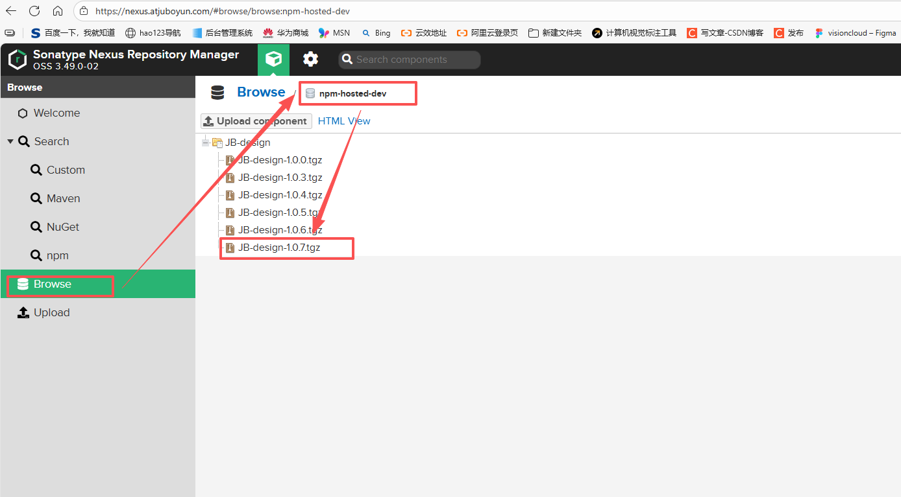

<!--
 * @Author: wyk
 * @Date: 2025-10-23 09:02:13
 * @LastEditTime: 2025-10-04 18:22:00
 * @Description:
-->

# 操作指南

## 拉取代码仓库地址

https://gitlab.atjuboyun.com/cpyf/components/jb-design-ui

## 打包上传方式

**1. 进入`JB-design`项目根目录下执行以下命令**

```
npm run build
```

**2. 进入`JB-design/build`项目根目录下打开`package.json`文件，植入`scripts`内容的`npm publish`代码**

```ts
{
    "name": "JB-design", // 组件库的名称
    "version": "1.0.7",  // 版本
    "description": "JB组件库",  // 组件库的介绍
    "main": "./lib/index.js",
    "module": "./es/index.js",
    "unpkg": "./dist/index.js",
    "typings": "./es/index.d.ts",
    "types": "./es/index.d.ts",
    "style": "dist/index.css",
    "scripts": {
        "test": "echo \"Error: no test specified\" && exit 1",
        "JB-design:dev": "npm publish --registry https://nexus.atjuboyun.com/repository/npm-hosted-dev/",  // 开发环境
        "JB-design:test": "npm publish --registry https://nexus.atjuboyun.com/repository/npm-hosted-test/",  // 测试环境
        "JB-design:prod": "npm publish --registry https://nexus.atjuboyun.com/repository/npm-hosted/",  // 生产环境
        "JB-design:pre": "npm publish --registry https://nexus.atjuboyun.com/repository/npm-hosted-pre/" // 预发布环境
    },
    "homepage": "https://wuyonggithub.github.io/", // 项目的仓库地址
    "sideEffects": [
        "dist/*",
        "*.css",
        "*.md"
    ],
    "keywords": [
        "fit",
        "适配",
        "组件库",
        "scale",
        "ScaleBox",
        "vue3"
    ],
    "vetur": {
        "tags": "tags.json",
        "attributes": "attributes.json"
    },
    "author": "wyk",  // 作者
    "license": "ISC"
}
```

**3. 进入`JB-design/build`项目根目录下执行以下命令即可完成打包上传私服仓库**

```ts
npm run JB-design:dev // 将包上传到开发环境
or
npm run JB-design:dev // 将包上传到开发环境
or
npm run JB-design:dev // 将包上传到开发环境

```

**4. 查看是否上传成功，记住更新一版本就要在版本后面++1**



## 包管理器安装使用

**我们建议您使用包管理器（如 NPM、Yarn 或 pnpm）安装 JB-design**

```
# 选择一个你喜欢的包管理器
# NPM
$ npm install JB-design@x.x.x --registry https://nexus.atjuboyun.com/repository/npm-hosted-dev/

# Yarn
$ yarn add JB-design --registry https://nexus.atjuboyun.com/repository/npm-hosted-dev/

# pnpm
$ pnpm install JB-design --registry https://nexus.atjuboyun.com/repository/npm-hosted-dev/

```

## 完整引入

如果对打包后的文件大小不是很在乎，那么使用完整导入会更方便,但你需要提前下载好相关组件的依赖。

```ts
// main.ts
import { createApp } from "vue";
import JbDesign from "JB-design";
import "JB-design/dist/index.css";
import App from "./App.vue";

const app = createApp(App);

app.use(JbDesign);
app.mount("#app");
```

## 按需引入

1、您需要使用额外的插件来导入要使用的组件。

首先你需要安装`unplugin-vue-components`

```shell
pnpm add  unplugin-vue-components -D
```

2、复制该解析器

```ts
const JbDesignResolver = () => {
    return {
        type: "component" as const,
        resolve: (name) => {
            if (name.startsWith("Bq")) {
                const pathName = name.slice(2).toLowerCase();
                return {
                    importName: name,
                    from: "JB-design",
                    path: `JB-design/es/components/${pathName}/index.js`,
                    sideEffects: `JB-design/es/components/${pathName}/${name.slice(2)}.css`,
                };
            }
        },
    };
};
```

3、在`unplugin-vue-components`引用该解析器

```ts
// vite.config.ts
import Components from "unplugin-vue-components/vite";
import { JbDesignResolver } from "xxxx-你存储JbDesignResolver的文件";

export default defineConfig({
    // ...
    plugins: [
        Components({
            //...
            resolvers: [JbDesignResolver()],
        }),
    ],
});
```

## 手动导入

`JB-design` 提供了基于 ES Module 的开箱即用的`Tree Shaking` 功能。

但你需要加载该插件vite-plugin-import，解决本地开发时的动态加载、代码如下：

```ts
export default function importPlugin() {
    const regStr = /(?<!\/\/.*|\/\*[\s\S]*?\*\/\s*)import\s*{\s*([^{}]+)\s*}\s*from\s*['"]JB-design['"]/g;
    return {
        name: "vite-plugin-import",
        enforce: "pre",
        transform: (code: string, id: string) => {
            if (id.endsWith(".vue")) {
                const str = code.replaceAll(regStr, (match, imports) => {
                    const list = imports.split(",");
                    const pathList: string[] = [];
                    list.forEach((item: string) => {
                        item = item.trim();
                        const name = item.slice(2).charAt(0).toLowerCase() + item.slice(3);
                        const str = `import ${item.trim()} from 'JB-design/es/components/${name.trim()}';
                        import 'JB-design/es/components/${name.trim()}/${item.trim().slice(2)}.css'`;
                        pathList.push(str);
                    });
                    return pathList.join(";");
                });
                return str;
            }
            return code;
        },
    };
}
```

::: warning
exclude中必须排除JB-design、因为 JB-design 存在第三方包，vite预加载会报错、当然如果已安装了JB-design所有组件需要的包、则不需要做该处理
:::

```ts{7}
// vite.config.ts
import Components from "unplugin-vue-components/vite";
import ViteImportPlugin from "./src/utils/vite-plugin-import";

export default defineConfig({
    optimizeDeps:{
        exclude: ["JB-design"],
    },
  // ...
  plugins: [
     ViteImportPlugin(),
  ],
})

```

# 前端组件库版本控制与私有仓库发布规范

> **项目名称：** JB-DESIGN-UI  
> **维护团队：** 前端架构组  
> **最后更新：** 2025年10月20日  
> **适用范围：** 所有基于 npm + Nexus 的前端组件库项目

---

## 目标

1. 统一组件库版本管理流程
2. 规范发布到私有 NPM 仓库（Nexus）的操作
3. 支持多环境（开发、测试、预发、生产）发布
4. 保障版本稳定性与可追溯性
5. 防止错误发布或覆盖线上版本

---

## 私有 NPM 仓库地址

| 环境              | Registry 地址                                             |
| ----------------- | --------------------------------------------------------- |
| 开发环境（dev）   | `https://nexus.atjuboyun.com/repository/npm-hosted-dev/`  |
| 测试环境（test）  | `https://nexus.atjuboyun.com/repository/npm-hosted-test/` |
| 预发布环境（pre） | `https://nexus.atjuboyun.com/repository/npm-hosted-pre/`  |
| 生产环境（prod）  | `https://nexus.atjuboyun.com/repository/npm-hosted/`      |

> **登录认证**
>
> 所有发布操作需提前配置 `.npmrc` 并登录：
>
> ```bash
> npm login --registry=https://nexus.atjuboyun.com/repository/npm-hosted/
> ```

---

## 版本号规范（Semantic Versioning）

采用 [SemVer 2.0.0](https://semver.org/) 语义化版本规范：  
**MAJOR.MINOR.PATCH**

| 版本位  | 变更说明             | 示例              |
| ------- | -------------------- | ----------------- |
| `MAJOR` | 不兼容的 API 修改    | `1.0.0` → `2.0.0` |
| `MINOR` | 新功能（向下兼容）   | `1.2.0` → `1.3.0` |
| `PATCH` | 修复 bug（向下兼容） | `1.2.3` → `1.2.4` |

> **禁止手动修改 `package.json` 中的 `version` 字段！**  
> 请使用 `npm version` 命令自动更新并生成 Git Tag。

---

## 发布脚本配置（`package.json`）

```json
{
    "name": "JB-design",
    "version": "1.0.7",
    "description": "JB组件库",
    "main": "./lib/index.js",
    "module": "./es/index.js",
    "unpkg": "./dist/index.js",
    "typings": "./es/index.d.ts",
    "types": "./es/index.d.ts",
    "style": "dist/index.css",
    "scripts": {
        "test": "echo \"Error: no test specified\" && exit 1",
        "JB-design:dev": "npm publish --registry https://nexus.atjuboyun.com/repository/npm-hosted-dev/",
        "JB-design:test": "npm publish --registry https://nexus.atjuboyun.com/repository/npm-hosted-test/",
        "JB-design:pre": "npm publish --registry https://nexus.atjuboyun.com/repository/npm-hosted-pre/",
        "JB-design:prod": "npm publish --registry https://nexus.atjuboyun.com/repository/npm-hosted/"
    },
    "homepage": "https://wuyonggithub.github.io/",
    "sideEffects": ["dist/*", "*.css", "*.md"],
    "keywords": ["fit", "适配", "组件库", "scale", "ScaleBox", "vue3"],
    "vetur": {
        "tags": "tags.json",
        "attributes": "attributes.json"
    },
    "author": "wyk",
    "license": "ISC"
}
```

## 发布流程（标准操作）

### 1. 开发阶段（本地）

```
git checkout dev
git pull origin dev

# 开发完成后
git add .
git commit -m "feat: 新增 Button loading 状态"
git push origin dev
```

### 2. 发布开发版（供本地调试）

```
npm run JB-design:dev
```

**供本地项目通过以下方式安装测试：**

```npm
npm install JB-design@latest --registry https://nexus.atjuboyun.com/repository/npm-hosted-dev/
```

### 3. 发布测试版（测试环境）

```
git checkout test
git merge dev
git push origin test
npm run JB-design:test
```

**通知测试团队使用：**

```
npm install JB-design@latest --registry https://nexus.atjuboyun.com/repository/npm-hosted-test/
```

### 4. 发布预发布版（Pre-release）

# 创建预发布版本（如 1.2.3-rc.1）

```
npm version 1.2.3-rc.1 -m "chore: pre-release version %s"
# 发布到 pre 仓库
npm publish --registry https://nexus.atjuboyun.com/repository/npm-hosted-pre/
```

用于灰度发布或内部体验，不推荐线上使用。

### 5. 发布正式版（Production）

```
git checkout main
git merge test
git push origin main

npm run version:patch # 或 minor / major
npm run JB-design:prod
```

⚠️ 生产发布必须由负责人操作，且需双人复核。

## 关于Webpack构建的项目

支持`完整引入`和`按需导入`，但`手动导入`需要自行配置`babel-plugin-import` 详情见[文档](https://www.npmjs.com/package/babel-plugin-import)
